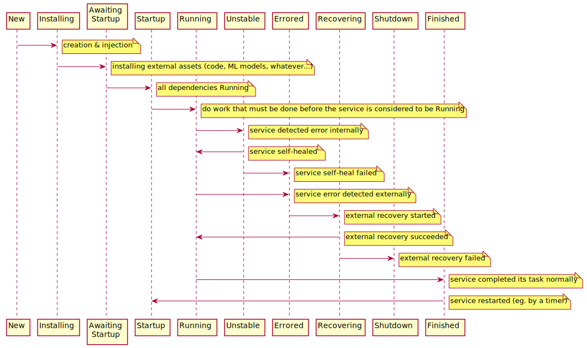

# Dependency Injection
Dependency Injection is really a misnomer: since dependency injection often involves
creating the object that is depended-on.  This has evolved into full lifecycle management.

<style>td,th,table { padding:0 4pt !important; border:none !important}</style>

At the core are three related classes:

| Class | Role |
| --------- | ---------------- |
`Context` | Collection of Objects.  This is the source of all objects that can be injected into other objects.  Getting an object from a Context may cause it to be created and injected. Injecting object B into object A implicitly states that "A depends on B", and adds a relationship to the dependency graph
| `Lifecycle` | The superclass of all objects that have lifecycles.  The dependency graph constructed by injection influences the progress of objects through their life cycles.  If A depends on B, then A will not be started until B is started.  This can be influenced by the @StartWhen annotation.
| `Configuration` | All objects can potentially have configuration parameters.  Some are used by the `Context` and `Lifecycle` classes.  A particularly interesting usage in the Context object where an injected dependency may be replaced by some sub class/interface - enabling "mocking" for simulation and test.

You start by creating a context:
```java
var c = new Context();
```

Then you "get" an object from it:
```java
var root = c.get(Bogon.class);
```
If there is no instance of the Bogon class in the context, it is created via it's default constructor.  Then, if it is a Lifecycle class, its lifecycle begins.

Say the class looks like this:
```java
class Bogon {
    @Inject Engine e;
}
```
When this class is created by the initial get(), it will be searched for dependencies that need to be injected, which will cause a get(Engine.class) to happen, and the process repeats.  One single initial "get" can cause a whole web of objects to be created.

Done this way, every object is a singleton.  But if you need to have multiple similar objects in the context, they can be named:
```java
    @Inject @Named("left")  Engine le; // left engine
    @Inject @Named("right") Engine re; // right engine
```

### Lifecycles
Objects that subclass Lifecycle also participate in life cycle management.  Such objects
can be in any of the following states:

| State | Meaning
| ----- | -------
|    Stateless | Object does not have a state (it is not a Lifecycle)
|    New | Freshly created, probably being injected
|    Installing | Associated artifacts being installed.  TODO: This should probably be preceded by a new state: PreparingToInstall which can run while the service is running, and should do downloads in preparation to installation.
|    AwaitingStartup | Waiting for some dependency to start Running
|    Starting | Executed when all dependencies are satisfied. When this step is completed the service will be Running.
|    Running | Up and running, operating normally.  This is the only state that should ever take a significant amount of time to run.
|    Unstable | Running, but experiencing problems that the service is attempting to repair itself
|    Errored | Not running.  It may be possible for the enclosing framework to restart it.
|    Recovering | In the process of being restarted
|    Shutdown | Shut down, cannot be restarted
|    Finished | The service has done it's job and has no more to do.  May be restarted (for example, by a timer)


            

